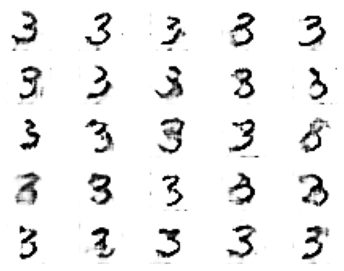

# wgan_mnist
This project trains a WGAN on the MNIST dataset to generate images of handwritten digits.

### Context

The Wasserstein Generative Adversarial Network (WGAN) is a variant of generative adversarial network (GAN).
The aim of GANs is to learn how to generate new data that looks similar to the training set.
WAGNs use the 1-Wasserstein distance as an alternative to the Jensen-Shannon divergence implemented in traditional GANs.
The original GAN method is based on the GAN game, a zero-sum game with 2 players: generator and discriminator. <br>
For additional details, you can refer to several important articles in the appendix.

### Usage 
```
git clone https://github.com/ayjab/wgan_mnist/
pip install -r requirements.txt
cd C:/Users/user/wgan_mnist
pip python main.py
```
### Test



### Appendix: Useful Articles

Here are some articles that provide more information about WGANs and how they work:

1. [Wasserstein GAN](https://arxiv.org/abs/1701.07875): The original paper that introduced WGANs.
2. [Some Theoretical Insights into Wasserstein GANs](https://arxiv.org/abs/2006.02682): A very useful article written by my professors at Sorbonne University, G. Biau, M. Sangnier, and U. Tanielian.
3. [Understanding Wasserstein GANs](https://medium.com/@jonathan_hui/gan-wasserstein-gan-wgan-gp-6a1a2aa1b490): A blog post that provides a good explanation of WGANs.
4. [How to Implement Wasserstein Loss for Generative Adversarial Networks](https://machinelearningmastery.com/how-to-code-a-wasserstein-generative-adversarial-network-wgan-from-scratch/): A tutorial on how to implement WGANs.

